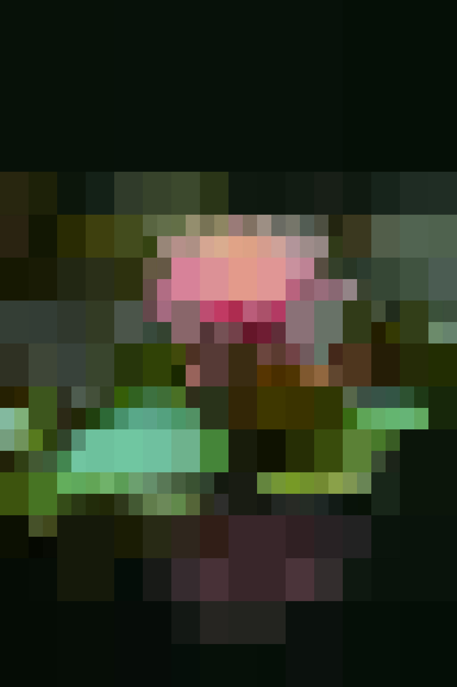
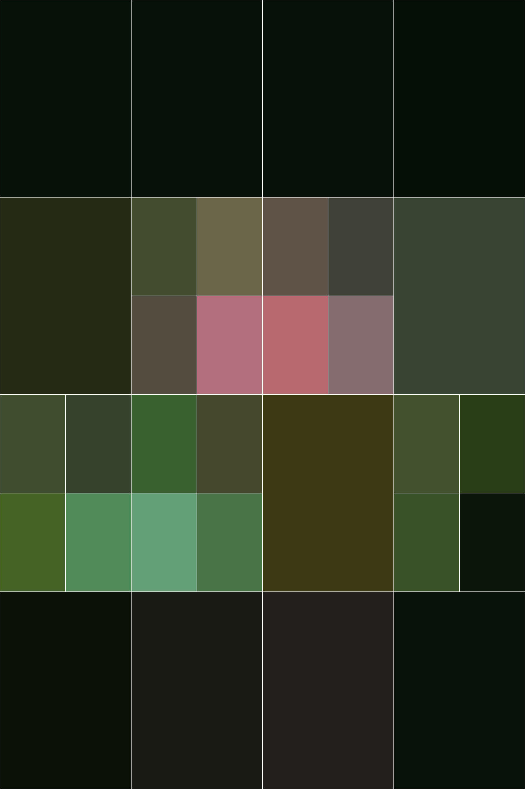
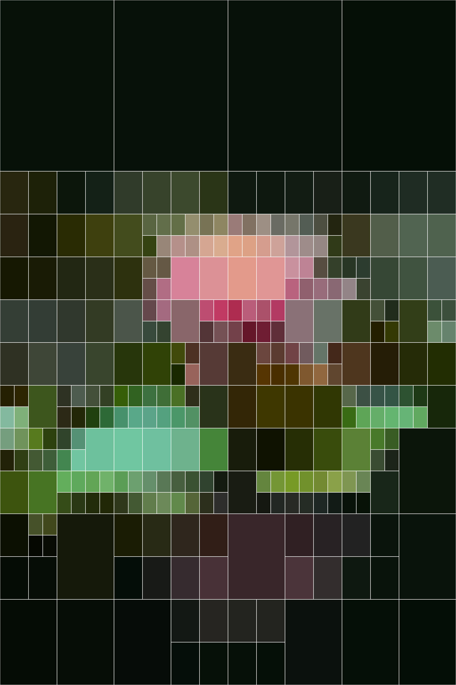
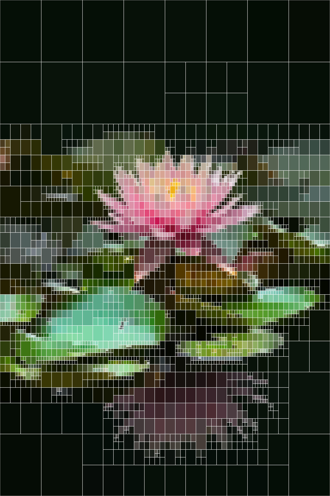
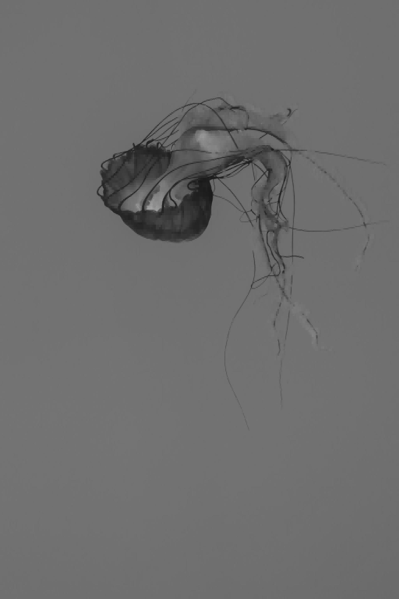
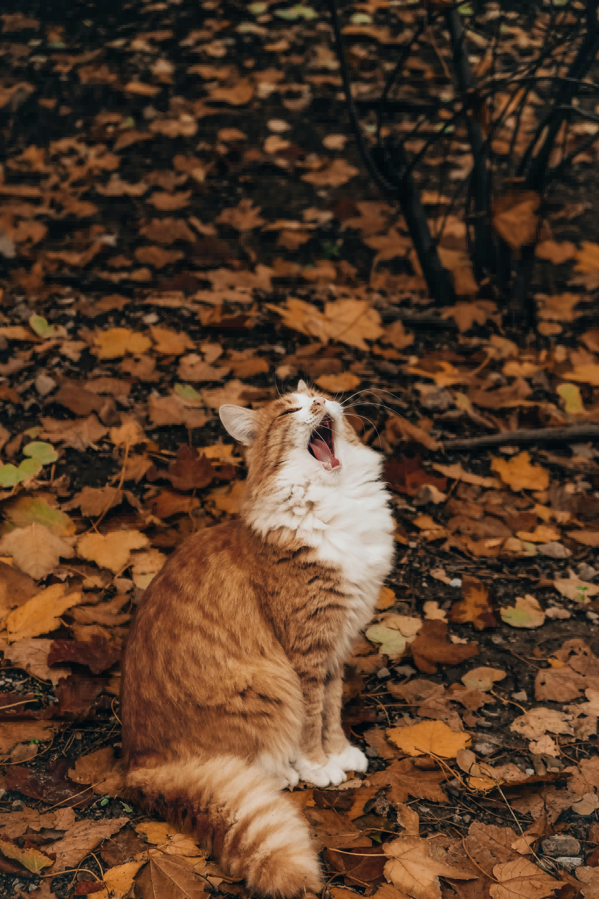

# comprs

Insanely fast quad-tree based image compression cli, inspired by [this project](https://github.com/Inspiaaa/QuadTreeImageCompression). Here's a demo that runs the program 500 times, for 50,000 iterations each, taking just under 2 minutes to finish.

```bash
$ time (for i in {1..500}; do ./comprs ./images/flower.jpg -iter 50000; done;)
0.19s user 0.16s system 0% cpu 1:56.94 total
```

<div style="text-align: center;">
  
</div>

## how it works

A quad-tree is a data structure that recursively splits spacial data into four children, allowing for more efficient representation of the data. For image data, this looks like storing entire regions of the image as simply the average color of all pixels in the region. Each iteration, the algorithm finds leaf node with the most variance in color, and splits it.

The most expensive part of the main algorithm is calculating the variance of each region of pixels. However, this implementation is able to achieve *constant* time variance calculations by storing image data in a prefix sum array.

## usage

```
$ cargo run --release -- -h
usage: target/release/comprs <input-file> [-o output-file] -iter <iterations> [-outline hex-code] [-gif save-delta]
input-file        - path to input image, supports .{jpg,png,...}
-o output-file    - [optional] where to save output image, supports .{jpg,png,...}
-iter iterations  - number of times to split the quad-tree, more iterations means higher quality image
-outline hex-code - [optional] color to outline each sub-region of the quad-tree (e.g. -outline FF0000)
-gif save-delta   - [optional] save the algorithm process to a gif, save the image every `save-delta` iterations
```

## examples

|  |  |  |
| :---: | :---: | :---: |
| 100 iterations | 1000 iterations | 50,000 iterations |

In the following images, the outlines of the regions are shown. Notice how the algorithm prioritizes splitting up regions covering the flower and its leaves, which have more detail compared to the background.

|  |  |  |
| :---: | :---: | :---: |
| 10 iterations | 100 iterations | 1,000 iterations |

|  |  |  |
| :---: | :---: | :---: |
| 100 iterations | 20000 iterations | an animation of the process up to 500 iterations |

The following example demonstrates the speed of the program. Note that most of the running time comes from actually opening the original image and saving the new image as a jpg.

|  |  |  |
| :---: | :---: | :---: |
| original image, 6000 by 4000 pixels | 5,000 iterations, 1.6 seconds | 100,000 iterations, in 1.8 seconds |
